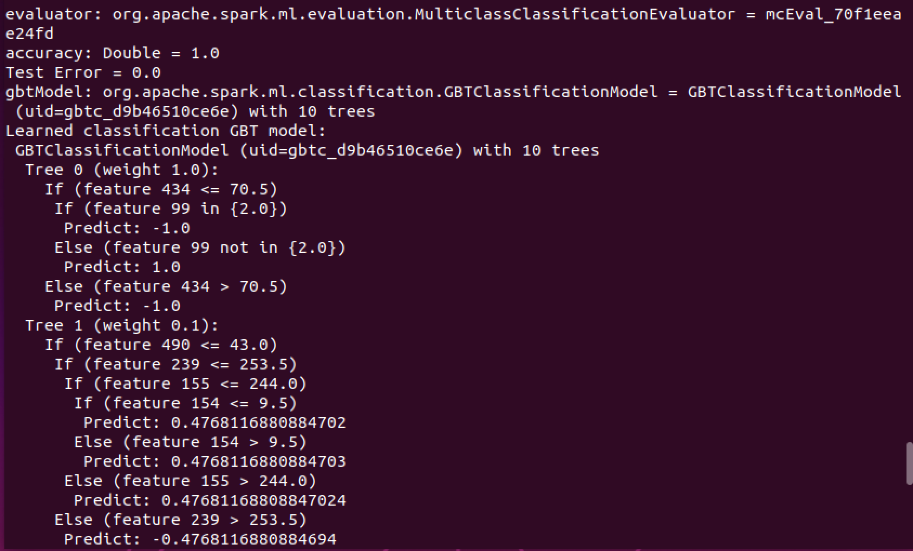

# Gradient-Boosted Tree Classifier

It is a machine learning technique used for regression analysis and for statistical classification problems, which produces a predictive model in the form of a set of weak prediction models, typically decision trees. GBT builds trees one at a time, where each new tree helps correct the mistakes made by a previously trained tree.

## Code

Split the data into training and test sets (70% Training, 30% Testing)

```scala
    val Array(trainingData, testData) = data.randomSplit(Array(0.7, 0.3))
```

Train a GBT model.

```scala
    val gbt = new GBTClassifier().setLabelCol("indexedLabel").setFeaturesCol("indexedFeatures")
    .setMaxIter(10).setFeatureSubsetStrategy("auto")
```

Train model. This also runs the indexers

```scala
val model = pipeline.fit(trainingData)
```

## Output
