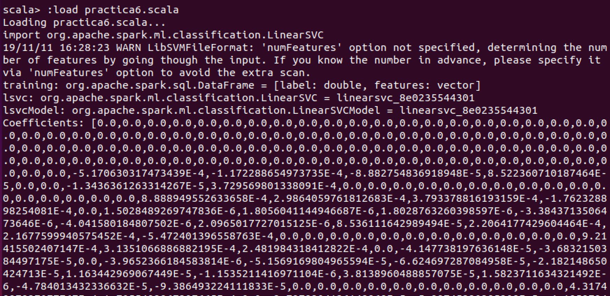

# Linear Support Vector Machine

A support vector machine (SVM) is a supervised learning algorithm that can be used for binary classification or regression. Support vector machines are very popular in applications such as natural language processing, speech, image recognition and artificial vision.
A support vector machine constructs an optimal hyperplane in the form of a decision surface, so that the margin of separation between the two classes in the data is maximized. Support vectors refer to a small subset of the training observations that are used as support for the optimal location of the decision surface.

## Code

Load training data

```scala
    val training = spark.read.format("libsvm").load("data/mllib/sample_libsvm_data.txt")
```

Train the model

```scala
    val lsvc = new LinearSVC()
    .setMaxIter(10).setRegParam(0.1)
```

Fit the model

```scala
    val lsvcModel = lsvc.fit(training)
```

## Output
