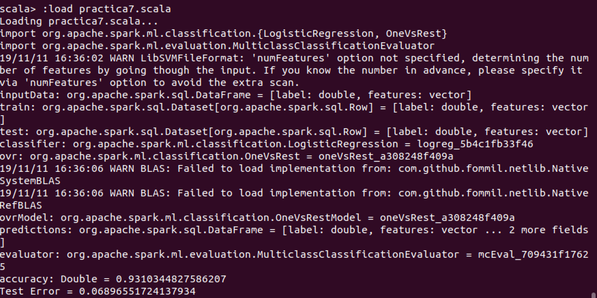

# One-vs-Rest Classifier

The one against all classification is a method that involves training with N distinct binary classifiers, each designed to recognize a particular class. One-vs-All is derived from an automated learning reduction to be able to perform a multi-class classification given a base classifier that can perform the binary classification efficiently.

One Vs All is implemented as an estimator. For the base classifier, it takes instances of Classifier and creates a binary classification problem for each of the k classes. The classifier for class i is trained to predict whether the label is i or not, distinguishing class i from all other classes.
Predictions are made by evaluating each binary classifier and the index of the safest classifier is generated as a label.

## Code

Generate the train/test split

```scala
    val Array(train, test) = inputData.randomSplit(Array(0.8, 0.2))
```

Instantiate the base classifier

```scala
    val classifier = new LogisticRegression().setMaxIter(10)
    .setTol(1E-6).setFitIntercept(true)
```

Train the multiclass model

```scala
    val ovrModel = ovr.fit(train)
```

Compute the classification error on test data

```scala
    val accuracy = evaluator.evaluate(predictions)
```

## Output
