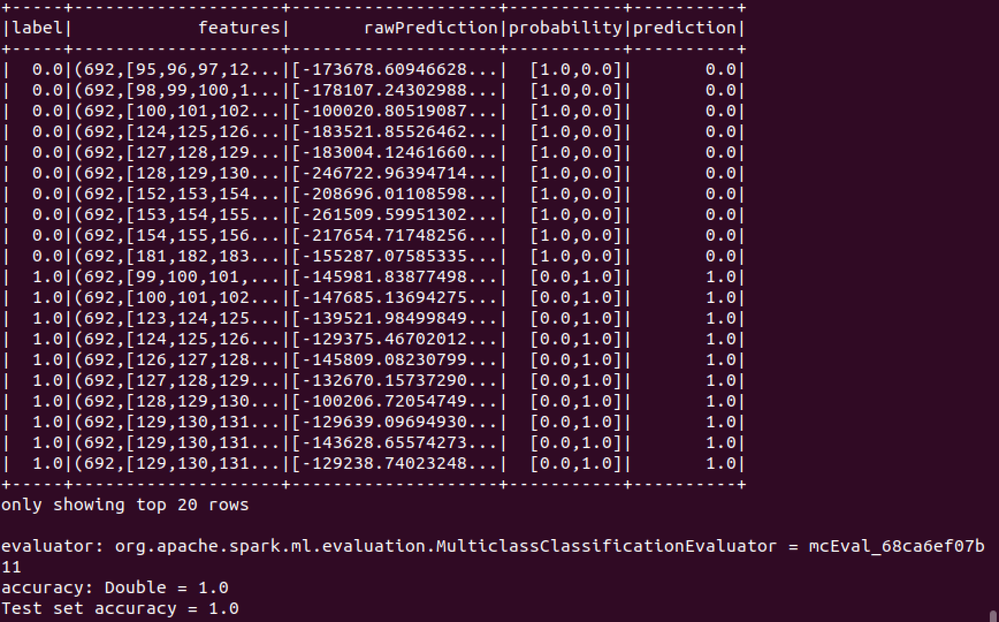

# Naive Bayes

A Naive Bayes classifier is a probabilistic machine learning model that is used for the classification task. The crux of the classifier is based on Bayes' theorem. Using Bayes' theorem, we can find the probability that A will occur, since B has occurred. Here, B is the evidence and A is the hypothesis. The assumption made here is that the predictors / characteristics are independent. That is, the presence of a particular characteristic does not affect the other. That's why it's called naive.

## Code

Split the data into training and test sets (30% held out for testing)

```scala
    val Array(trainingData, testData) = data.randomSplit(Array(0.7, 0.3), seed = 1234L)
```

Train a NaiveBayes model

```scala
    val model = new NaiveBayes().fit(trainingData)
```

## Output
