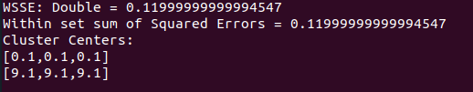
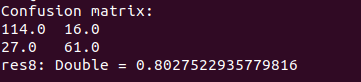

## Kmeans

The first, we're going to use the libraries below, theses libraries constains the functions that we need to configure our k means algorithms.
```scala
import org.apache.spark.sql.SparkSession
import org.apache.spark.ml.clustering.KMeans
```

Then, we need to import the log4j package to minimalize the errors on the output.
```scala
import org.apache.log4j._
Logger.getLogger("org").setLevel(Level.ERROR)
```

Also we need to start a new Spark session using the defult function.
```scala
val spark = SparkSession.builder().getOrCreate()
```

We need to create a new dataframe using an txt files that contains the data we will use in k-means
```scala
val dataset = spark.read.format("libsvm").load("sample_kmeans_data.txt")
```

It's time to use the KMeans function, we declare the configuration of our model, we use the K = 3 to search 2 cluster. Then, we fit the datast that we created before and save them in a new model
```scala
val kmeans = new KMeans().setK(2).setSeed(1L)
val model = kmeans.fit(dataset)
```

The model has a computeCost function it's used to calculate the  sum of squared distance of points to their nearest center
```scala
val WSSE = model.computeCost(dataset)
println(s"Within set sum of Squared Errors = $WSSE")
```

Well, once we set all before we print the clusters that Kmeans find.
```scala
println("Cluster Centers: ")
model.clusterCenters.foreach(println)
```
### Output


## Logistic Regression

The first, we're going to use the libraries below, theses libraries constains the functions that we need to configure our Logistic Regression algorithm.
```scala
import org.apache.spark.ml.classification.LogisticRegression
import org.apache.spark.sql.SparkSession
import org.apache.spark.ml.feature.{VectorAssembler, StringIndexer, VectorIndexer, OneHotEncoder}
import org.apache.spark.ml.linalg.Vectors
import org.apache.spark.ml.Pipeline
import org.apache.spark.mllib.evaluation.MulticlassMetrics
```

Then, we need to import the log4j package to minimalize the errors on the output.
```scala
import org.apache.log4j._
Logger.getLogger("org").setLevel(Level.ERROR)
```

Also we need to start a new Spark session using the defult function.
```scala
val spark = SparkSession.builder().getOrCreate()
```

We need to create a new dataframe using an csv files that contains the data we will use in Logistic Regression
```scala
val data  = spark.read.option("header","true").option("inferSchema", "true").format("csv").load("titanic.csv")

```

Before we have our dataframe created we need create other dataframe again but this time selecting a few columns from the original dataframe and we'll call it as logregdataall.
```scala
val logregdataall = (data.select(data("Survived").as("label"), $"Pclass", $"Name",
                    $"Sex", $"Age", $"SibSp", $"Parch", $"Fare", $"Embarked"))
```

We cleaned the logregdataall before using, this feature data contains already all the data without nah or null values. 
```scala
val logregdata = logregdataall.na.drop()
```

The StringIndexer takes a column which has categorical data, and then convert the categorical values to numerical values
```scala
val genderIndexer = new StringIndexer().setInputCol("Sex").setOutputCol("SexIndex")
val embarkIndexer = new StringIndexer().setInputCol("Embarked").setOutputCol("EmbarkIndex")
```

The GenderEncoder takes a column which has categorical data, which has been label indexed, and then splits the column into multiple columns. 
```scala
val genderEncoder = new OneHotEncoder().setInputCol("SexIndex").setOutputCol("SexVec")
val embarkEncoder = new OneHotEncoder().setInputCol("EmbarkIndex").setOutputCol("EmbarkVec")
```

Then, we create a new Vector Assembler that it will contain all the features inside of a column called features
```scala
val assembler = (new VectorAssembler()
                  .setInputCols(Array("Pclass","SexVec", "Age","SibSp","Parch","Fare","EmbarkVec"))
                  .setOutputCol("features"))
```

Split the data into training and test sets (70% Training, 30% Testing)
```scala
val Array(training, test) = logregdata.randomSplit(Array(0.7, 0.3), seed = 12345)
```

We initialize a new LogisticRegression function
```scala
val lr = new LogisticRegression()
```

Now we create an pipeline passing one array that contains all the indexer, encoders, vector assembler we create before.
```scala
val pipeline = new Pipeline().setStages(Array(genderIndexer,embarkIndexer,genderEncoder,embarkEncoder,assembler,lr))
```

We adust the Pipeline using the training data
```scala
val model = pipeline.fit(training)
```

We process the model with the testing data
```scala
val results = model.transform(test)
```

it's show the predictions of the results given by the model are selected
```scala
val predictionAndLabels = results.select($"prediction",$"label").as[(Double, Double)].rdd
val metrics = new MulticlassMetrics(predictionAndLabels)
```

Show the confusion matrix
```scala
println("Confusion matrix:")
println(metrics.confusionMatrix)
```

And then, we show the accuracy
```scala
metrics.accuracy
```

### Output



